# Veiviser: Test av Federated Credentials med GitHub Actions (git.ntnu.no)

Når du har satt opp **federated credentials** mellom git.ntnu.no og Azure, bør du teste at tilkoblingen fungerer. Denne guiden viser deg hvordan du gjør det med en enkel workflow-fil.

---

## 1. Opprett workflow-fil
1. Før vi kan opprette workflow i git.ntnu.no organisasjonen vår, må en først opprette runners som en kan benytte seg av. Hvis ikke, vil en få følgende melding i toppen av Actions på git.ntnu.no
   1. 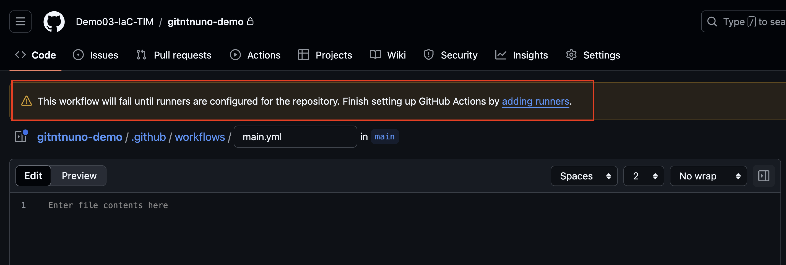
2. Gå til ditt repository i Git.ntnu.no og Klikk på **Settings** i toppen og deretter **Actions** og så **Runners**.
   1. 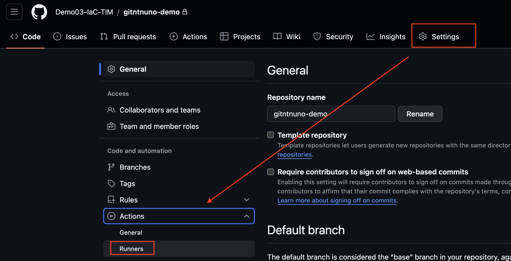
3. Velg deretter **New self-hosted runners**
   1. 
4. Her er det viktig at du velger det operativsystemet **du kjører**, siden alle kommandoene som står under vil være tilpasset valgt OS. For MacOS: Start terminal og følg kommandoene fortløpende (klikk på copy ikonet når du holder musen over kommandoene). For Windows: Trykk Windowstast og skriv CMD (eller PowerShell). Høyreklikk på valgt shell og start det som administrator og kjør kommandoene som vises på nettsiden.
   1. 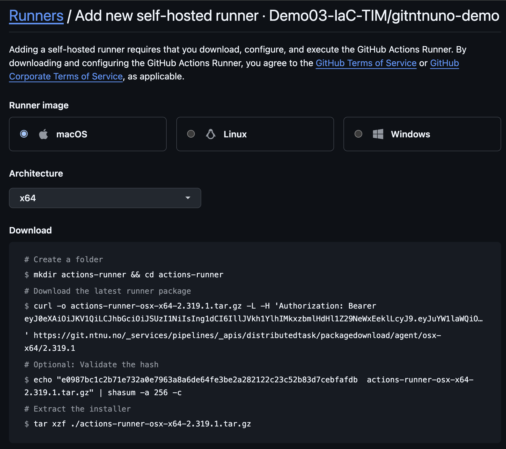
5. Følg deretter instruksjonene som står i Download og Configure
6. Ved spørsmål om runner group, name etc, trykk enter for default verdier:
   1. 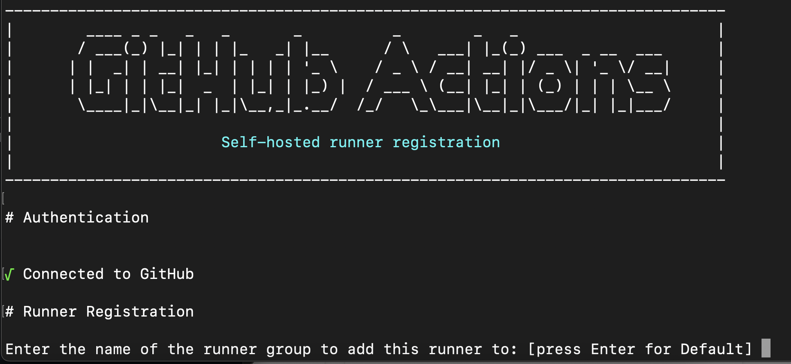
7. Når en kjører siste kommando `run`, vil en se at runner står og venter på jobb:
   1. 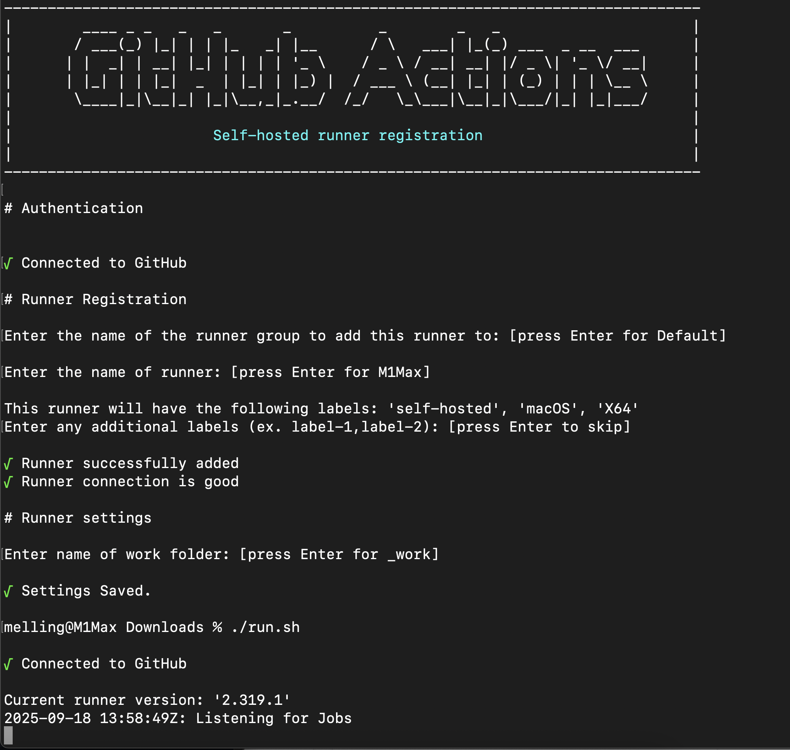
8. Opprett en ny workflow: **set up a workflow yourself**. Gå til Actions under ditt repo.
   1. 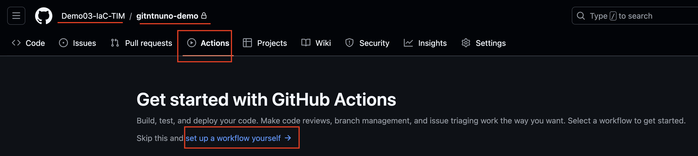
9.  Lag en fil med navnet:  
   `.github/workflows/azure-login-test.yml`
10. Lim inn eksempelinnhold under, MEN! MERK at en må legge til egen informasjon om `runs-on`, denne informasjonen finner du som vist på bilde i punkt 7 som `This runner will have the following labels: 'self-hosted', 'DIN EGEN INFO', 'DIN EGEN INFO'`. I tillegg er on: satt til workflow_dispatch, som vil si manuell trigger. 
   1. 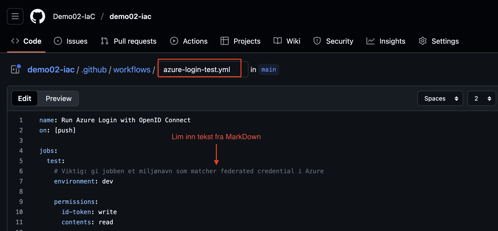

```yaml
name: Azure OIDC login via self-hosted runner

on:
  push:
    branches: [ main ]

jobs:
  login-and-check:
    runs-on: [self-hosted, macOS, X64]
    environment: dev
    permissions:
      id-token: write
      contents: read

    steps:
      - uses: actions/checkout@v4

      - name: Sanity check repository secrets
        run: |
          test -n "${{ secrets.AZURE_CLIENT_ID }}" || { echo "Missing AZURE_CLIENT_ID (repo secret)"; exit 1; }
          test -n "${{ secrets.AZURE_TENANT_ID }}" || { echo "Missing AZURE_TENANT_ID (repo secret)"; exit 1; }
          test -n "${{ secrets.AZURE_SUBSCRIPTION_ID }}" || { echo "Missing AZURE_SUBSCRIPTION_ID (repo secret)"; exit 1; }

      - name: Azure login (OIDC)
        uses: azure/login@v2
        with:
          client-id: ${{ secrets.AZURE_CLIENT_ID }}
          tenant-id: ${{ secrets.AZURE_TENANT_ID }}
          subscription-id: ${{ secrets.AZURE_SUBSCRIPTION_ID }}
          enable-AzPSSession: false

      - name: Azure CLI (native on runner)
        shell: bash
        run: |
          az --version
          az account show
```
---

## 2. Viktige detaljer
- `environment: dev` må matche **navnet på environment** i GitHub **og** den federated credential du opprettet i Azure (dev, test, prod).
- `permissions: id-token: write` er nødvendig for at GitHub kan be om et OIDC-token.
- Secrets `AZURE_CLIENT_ID`, `AZURE_TENANT_ID` og `AZURE_SUBSCRIPTION_ID` må allerede være lagt inn i repository settings.

---

## 3. Kjør workflow
1. Commit changes til repository
   1. 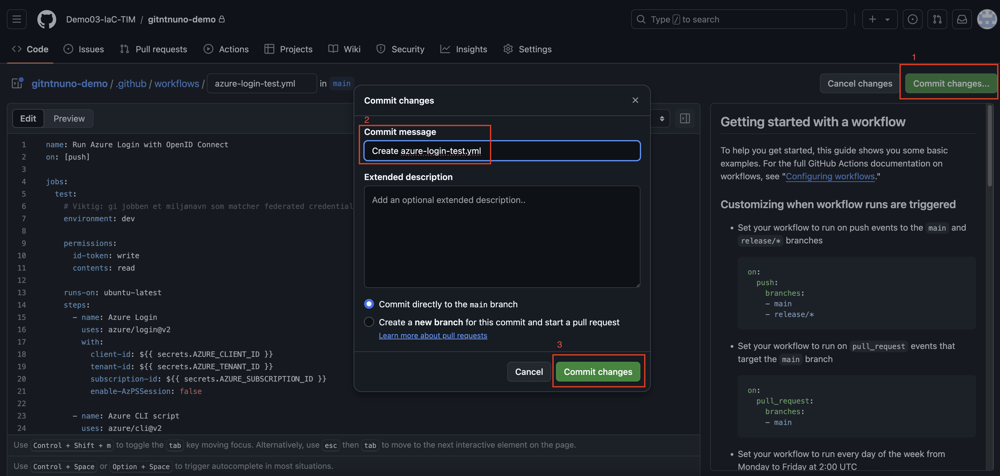
2. Gå deretter til fanen **Actions** under ditt repo på git.ntnu.no.
3. Velg workflowen du nettopp opprettet (klikk på navnet, kan ta noen sekunder før den dukker opp).
   1. 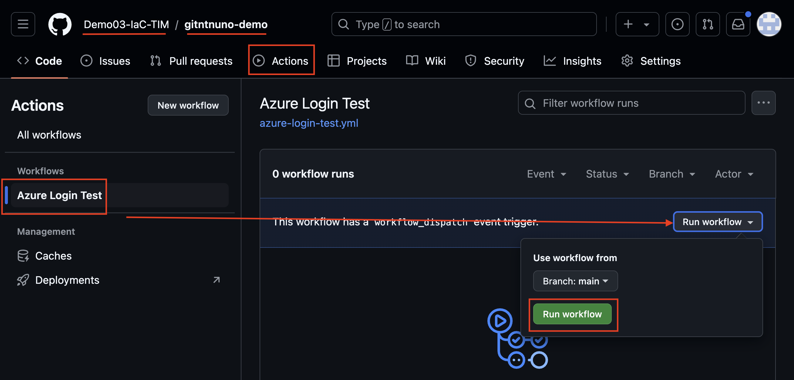
4. Følg med på loggene ved å klikke på jobben (mulig du må oppdatere nettsiden for å vise jobben).
   1. 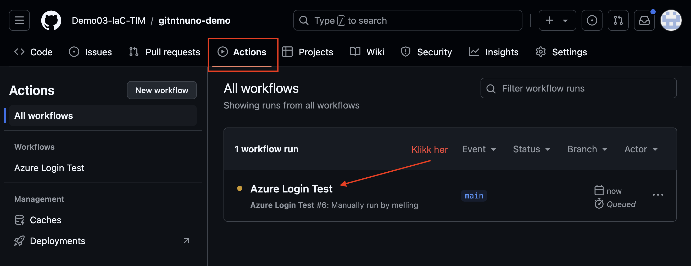
5. Når jobben er ferdig med å kjøre, vil en se noe tilsvarende i Web GUI:
   1. 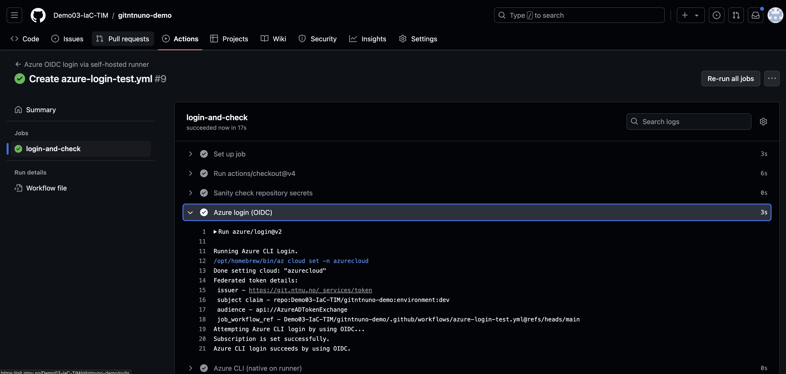
6. I tillegg vil du i terminalen du har åpen med din runner, se at jobben har blitt utført:
   1. 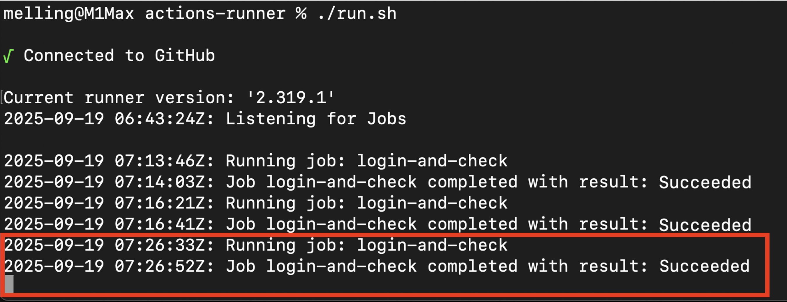

---

## 4. Sjekk resultatet
- Hvis oppsettet fungerer, vil du se at `az account show` returnerer detaljer om din Azure-konto (Subscription ID, Tenant ID osv.).
- Hvis det feiler, sjekk:
  - At environment-navnet matcher nøyaktig (`dev`, `test`, eller `prod`).
  - At federated credentials i Azure Portal peker på riktig **organisasjon/repository/environment**.
  - At secrets i GitHub er lagt inn korrekt.

---

## 5. Variant for test og prod
For å teste `test` eller `prod`, kan du enten:
- Endre `environment: dev` til `environment: test` eller `environment: prod` i samme fil, **eller**
- Kopiere filen og gi den nytt navn, f.eks. `.github/workflows/azure-login-test-env.yml` og `.github/workflows/azure-login-prod-env.yml`, og endre `environment`-feltet.

> Husk: Det må finnes en **federated credential** på App Registration i Azure som peker til akkurat det environment-navnet du bruker i workflowen.

---

## 6. Disable workflows
Etter at en ferdig med å teste er det lurt å disable (eventuelt slette) workflow. Workflow som er opprettet har on: [push] som trigger, og vil derfor kjøre hver gang en pusher noe til repoet. Om en har flere workflows (dev,test,prod) må disse også disables.
- 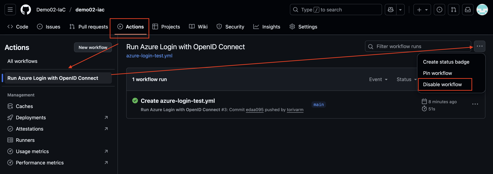

✅ Hvis du ser output fra `az account show`, er federated credentials satt opp riktig, og du kan bruke dette til Terraform-workflows og andre GitHub Actions.
