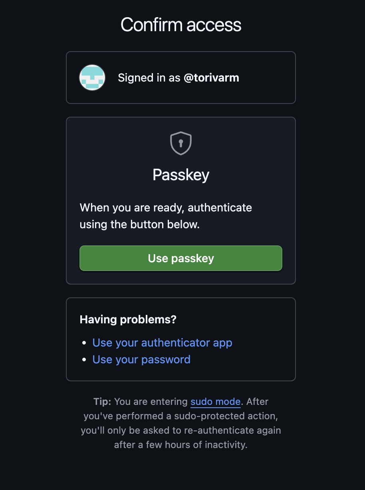
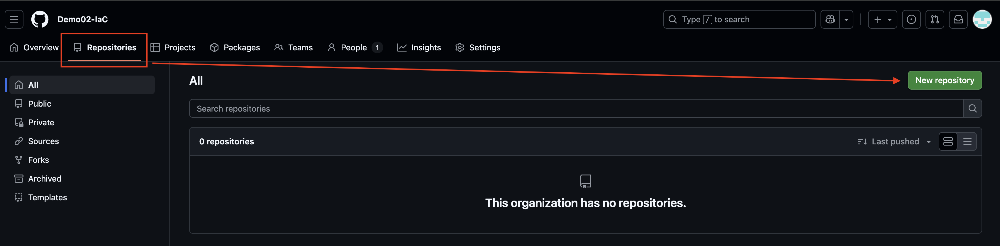
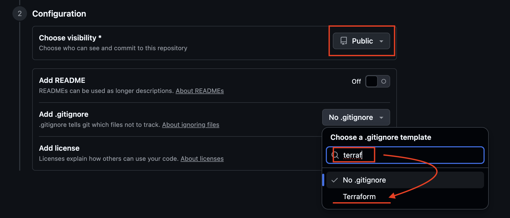

# Veiviser: Opprettelse av GitHub-organisasjon, repository og environments

Denne veiviseren viser deg hvordan du setter opp en organisasjon i GitHub, oppretter et repository og konfigurerer environments og secrets for bruk med Azure.

---

## 1. Opprett en organisasjon
1. Gå til [https://github.com/organizations/new](https://github.com/organizations/new).
2. Velg **Free**-plan.
   1. 
3. Skriv inn:
   1. Et ønsket unikt navn på organisasjonen (kan være hva som helst, kom på en eksempelorganisasjon).
   2. Kontakt e-postadresse
   3. Velg "My personal account"
   4. Aksepter Terms of service
   5. Next
4. Fullfør opprettelsen.
5. Velg deretter hvordan du vil bekrefte tilgang (passkey, authenticator app, password):
   1. 

---

## 2. Opprett et nytt repository
1. Gå inn i organisasjonen din og deretter Repository.
   1. 
2. Klikk på **New** for å opprette et nytt repository.
3. Gi repository et navn
4. Velg **Public** eller **Private** etter behov.
   1. Public: pass på hvilken informasjon du legger ut, men du får mer funksjonalitet. Vi skal ikke legge ut noe sensitiv i fagopplegget.
   2. Private: Ingen på internettet kan se det, mer begrenset funksjonalitet, vanskelig å dele med faglærer / læringsassistent.
5. Velg Terraform som .gitignore
   1. 
6. Klikk på **Create repository**.

---

## 3. Opprett environments (dev, test, prod)
1. Gå inn i repository.
2. Klikk på **Settings** → **Environments**.
   1. 
3. Klikk på **New environment**.
   - Gi navnet `dev`.
   - Lagre.
4. Gjenta prosessen og opprett environments `test` og `prod`.
   1. 

---

## 4. Legg til Repository Secrets
For å kunne bruke GitHub Actions mot Azure, må du legge inn nødvendige secrets.

1. Gå til repository → **Settings** → **Secrets and variables** → **Actions**.
2. Klikk **New repository secret**.
3. 
4. Opprett følgende secrets (navn må være nøyaktig som skrevet under):
   - `AZURE_CLIENT_ID` → Lim inn Client ID fra Azure.
   - `AZURE_SUBSCRIPTION_ID` → Lim inn Subscription ID fra Azure.
   - `AZURE_TENANT_ID` → Lim inn Tenant ID fra Azure.
5. Nå kan workflow-filer bruke disse secrets i GitHub Actions.

---

✅ Du har nå:
- En organisasjon
- Et repository
- Tre environments (`dev`, `test`, `prod`)
- Repository secrets for Azure

Neste steg blir å koble dette opp mot Terraform og Azure via GitHub Actions.
