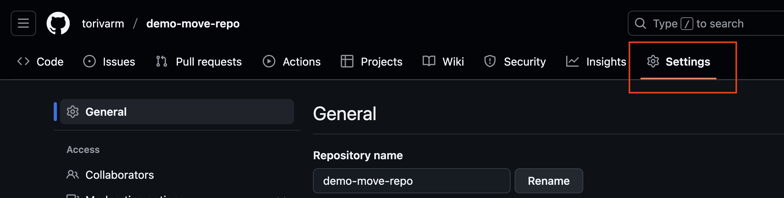
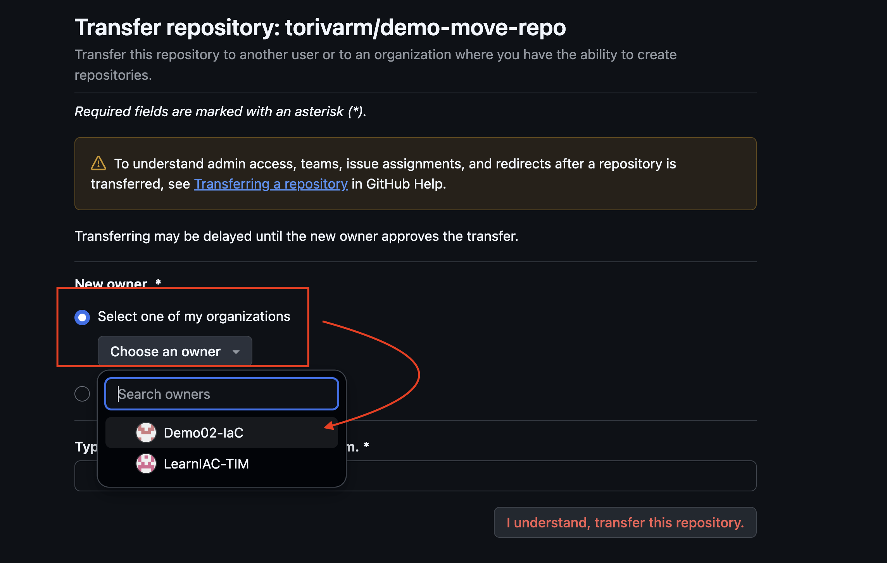
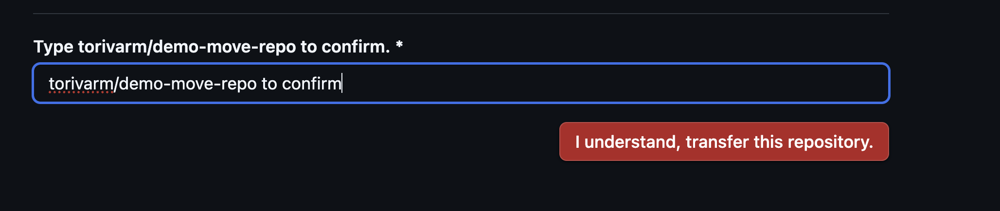
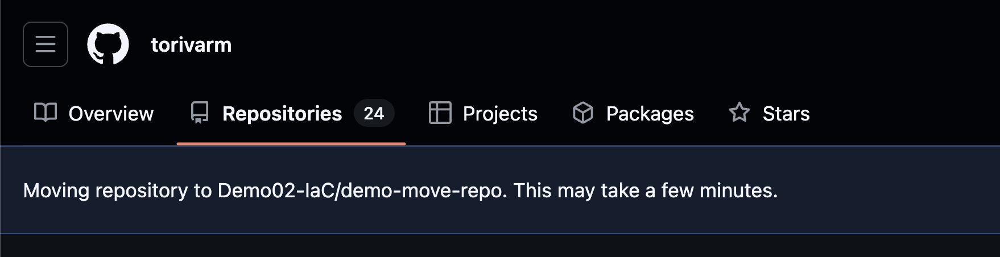
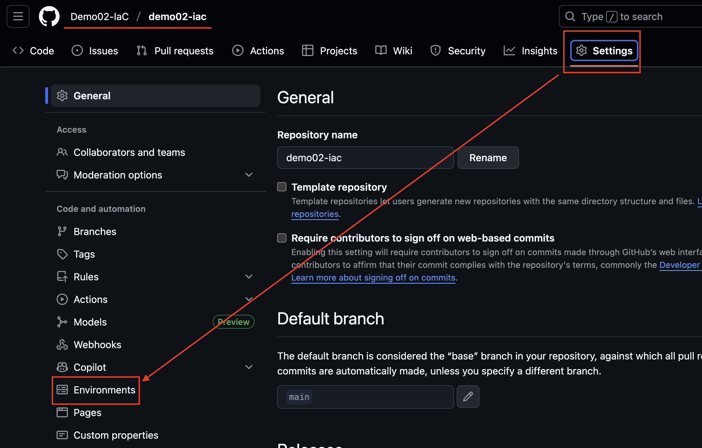
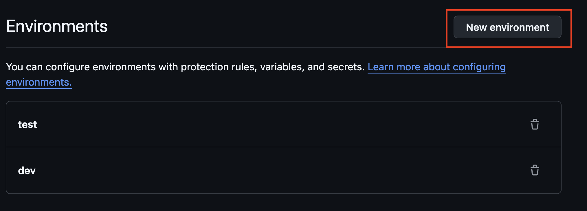
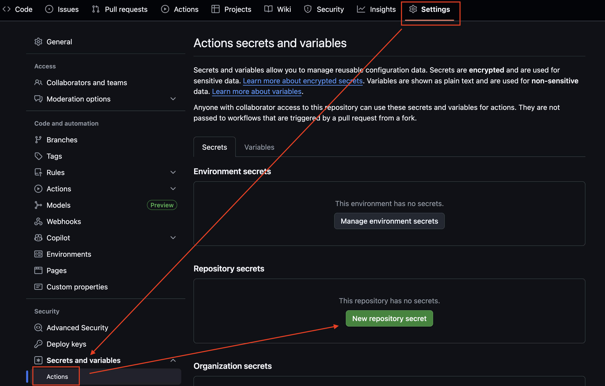
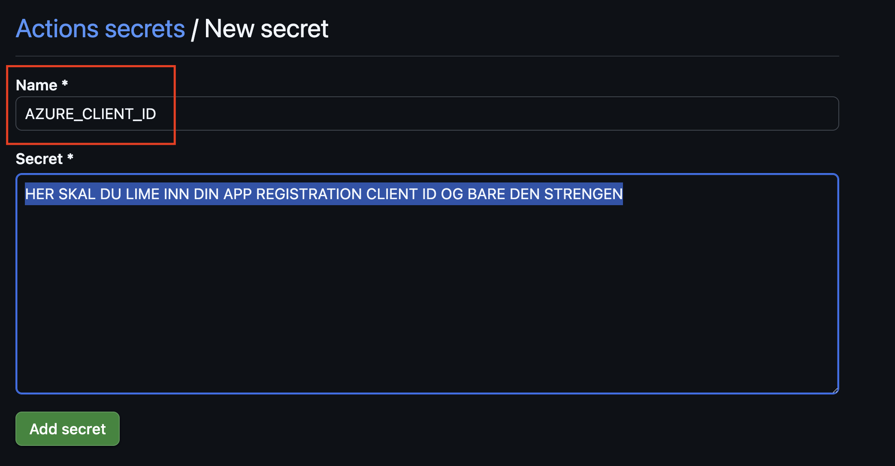
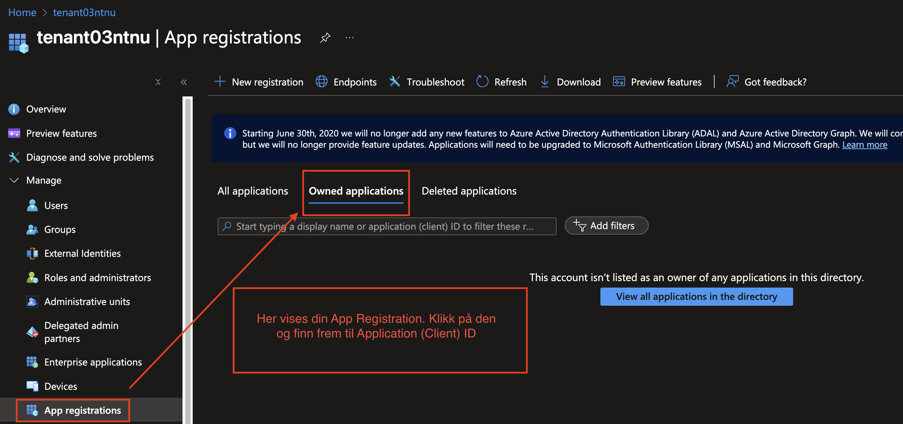
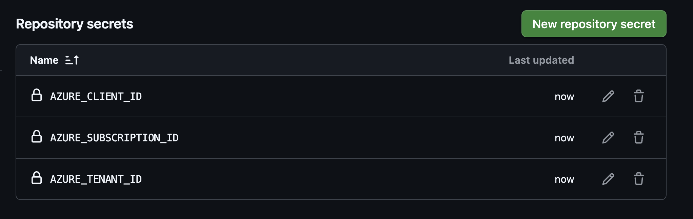

# Veiviser: Migrere et GitHub-repository til en organisasjon

Denne guiden viser deg hvordan du flytter et eksisterende repository til en organisasjon du har opprettet i GitHub.  

---

## 1. Forberedelser
- Sørg for at du er **eier** eller har tilstrekkelig rettigheter i organisasjonen.
- Sørg for at du har **admin-rettigheter** på repositoryet du vil flytte.
- Åpne repositoryet du ønsker å migrere (fra din egen brukerprofil).

---

## 2. Overfør repository til organisasjon
1. Gå inn på repositoryet du vil flytte.
2. Klikk på **Settings** (øverst i menyen).
   1. 
3. Scroll ned til seksjonen **Danger Zone**.
4. Velg **Transfer ownership**.
   1. 
5. Velg navnet på organisasjonen du vil flytte til (det du har opprettet i tidligere veiviser).
   1. 
6. Bekreft overføringen ved å skrive inn repository-navnet.
   1. 
7. Klikk **I understand, transfer this repository**.
   1. 

Repositoryet vil nå ligge under organisasjonen i stedet for din personlige GitHub-konto.

---

## 3. Oppdatere lokal tilkobling i VS Code
Når du flytter et repository, endres **URL-en** til `origin` i Git.  
Dette betyr at din lokale klone i VS Code fortsatt peker på den gamle adressen.

### Sjekk gjeldende URL
Åpne terminalen i VS Code og kjør:
```bash
git remote -v
```
Du vil deretter se noe som dette:
```bash
origin  https://github.com/ditt-brukernavn/repo-navn.git (fetch)
origin  https://github.com/ditt-brukernavn/repo-navn.git (push)
```

### Oppdater URL til den nye organisasjonen
Kjør følgende kommando for å oppdatere origin til den nye plasseringen:
```bash
git remote set-url origin https://github.com/<org-navn>/<repo-navn>.git
```
Bekreft endringen:
```bash
git remote -v
```

## 3. Opprett environments (dev, test, prod)
1. Gå inn i repository.
2. Klikk på **Settings** → **Environments**.
   1. 
3. Klikk på **New environment**.
   - Gi navnet `dev`.
   - Lagre.
4. Gjenta prosessen og opprett environments `test` og `prod`.
   1. 

---

## 4. Legg til Repository Secrets
For å kunne bruke GitHub Actions mot Azure, må du legge inn nødvendige secrets.

1. Gå til repository → **Settings** → **Secrets and variables** → **Actions**.
2. Klikk **New repository secret**.
3. 
4. Opprett følgende secrets (navn må være nøyaktig som skrevet under):
   - `AZURE_CLIENT_ID` → Lim inn DIN APP REGISTRATION Client ID fra Azure.
     - 
     - 
   - `AZURE_SUBSCRIPTION_ID` → Lim inn Subscription ID fra Azure.
   - `AZURE_TENANT_ID` → Lim inn Tenant ID fra Azure.
   - Når du er ferdig vil det se ut som dette (MERK, kan kun editeres i etterkant, en kan ikke vise verdien til en secret, som er hele poenget med en secret):
   - 
5. Nå kan workflow-filer bruke disse secrets i GitHub Actions.