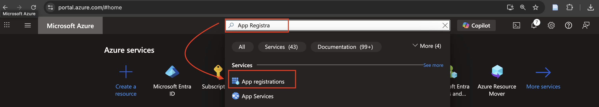
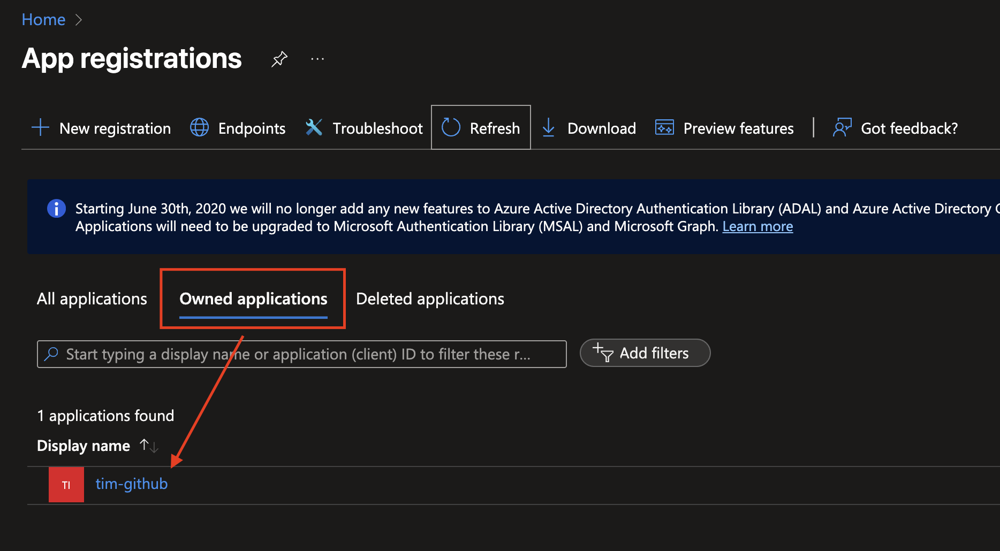
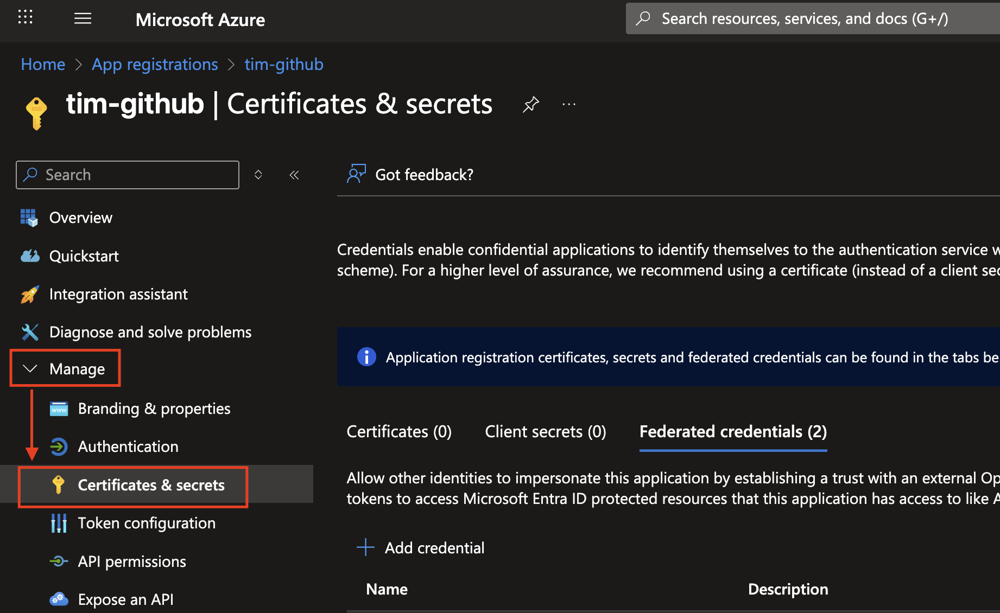
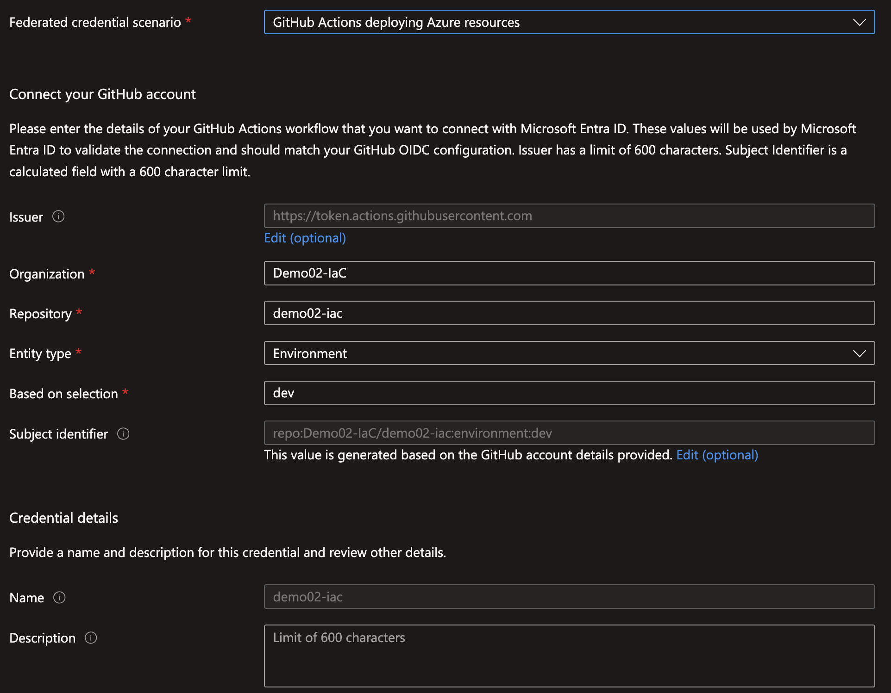

# Veiviser: Opprette Federated Credentials i Azure Portal for GitHub Actions

Denne guiden viser hvordan du oppretter federated credentials på din App Registration i Azure, slik at GitHub Actions kan autentisere seg uten bruk av hemmelige nøkler (password/secret).

---

## 1. Åpne App Registration
1. Logg inn i [Azure Portal](https://portal.azure.com).
2. Søk etter og gå inn på **App registrations**.
   1. 
3. Velg App Registration som skal brukes av GitHub Actions (den som er knyttet til `AZURE_CLIENT_ID`).
   1. 

---

## 2. Gå til Federated credentials
1. Klikk på menyvalget **Certificates & secrets**.
2. Velg fanen **Federated credentials**.
3. Klikk på **+ Add credential**.
   1. 

---

## 3. Legg til GitHub-referanse
For hvert environment (`dev`, `test`, `prod`) må du lage en egen credential.

1. Velg **Federated Credentials scenario**: `GitHub Actions deploying Azure resources`.
2. La Issuer stå til default value **Issuer**: `https://token.actions.githubusercontent.com`
3. Fyll ut feltene:
   - **Organization**: Navnet på din GitHub-organisasjon (det du nettopp har opprettet).
   - **Repository**: Navnet på repositoryet (det du nettopp opprettet eller migrerte til din organisasjon).
   - **Entity**: Velg environment, f.eks. `dev`.
4. Gi credentialen et beskrivende navn, f.eks. `github-dev`.
5. Klikk **Add**.
   1. Det vil se sånn ut for mitt eksempel:
   2. 

---

## 4. Gjenta for test og prod
- Gjenta samme prosess to ganger til:
  - `github-test` (environment = `test`)
  - `github-prod` (environment = `prod`)

---

## 5. Resultat
Du skal nå ha tre federated credentials på App Registrationen:
- `github-dev`
- `github-test`
- `github-prod`

Disse gjør at GitHub Actions workflows som kjører i de respektive environments kan autentisere seg mot Azure uten secrets.

---

## 6. Verifiser oppsettet
1. Gå til GitHub-repository → **Settings** → **Environments**.
2. Sjekk at environment-navnene (`dev`, `test`, `prod`) matcher nøyaktig med det du opprettet i Azure Portal.
3. Kjør en enkel workflow (f.eks. `az account show`) for å teste at autentiseringen fungerer (se egen veiviser).

---

✅ Nå er federated credentials konfigurert. GitHub Actions kan bruke **OpenID Connect (OIDC)** til å autentisere seg direkte mot Azure uten at du trenger å lagre nøkler manuelt i repository secrets.
