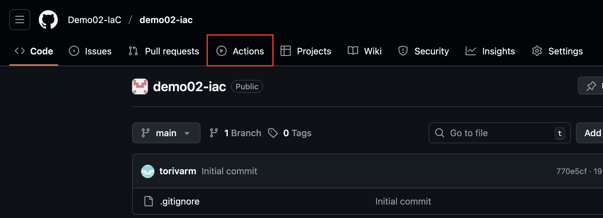
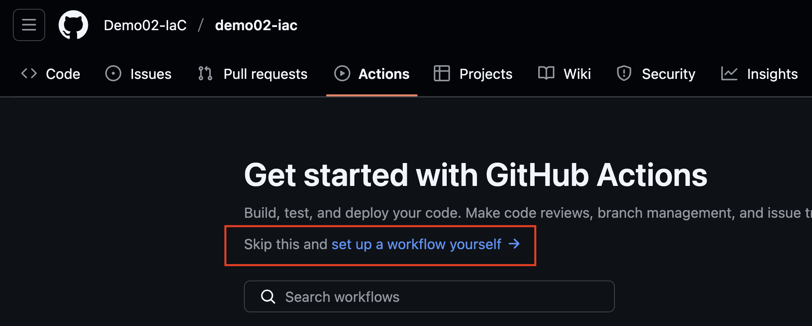
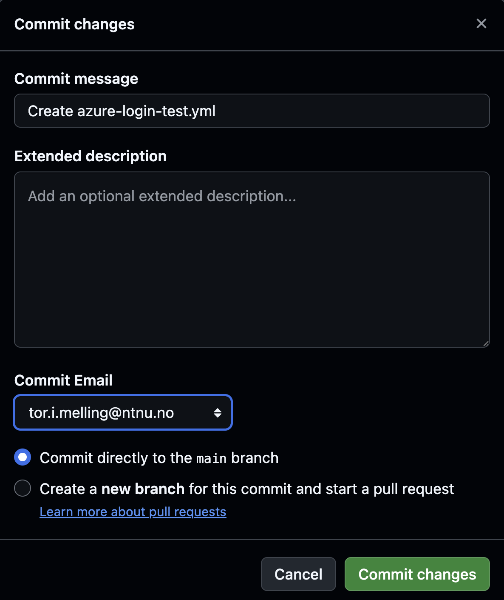
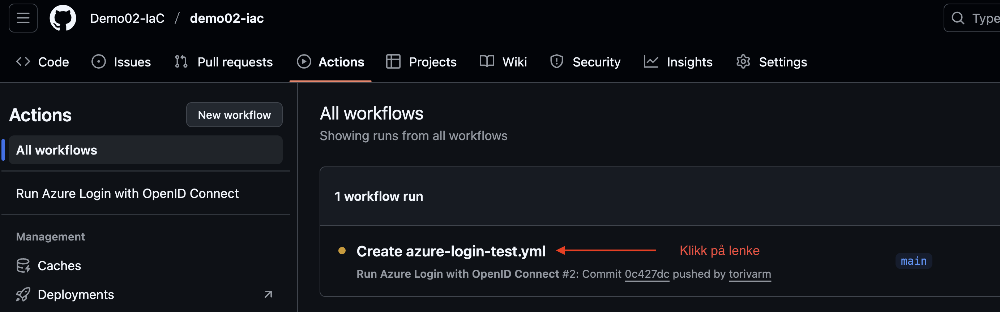
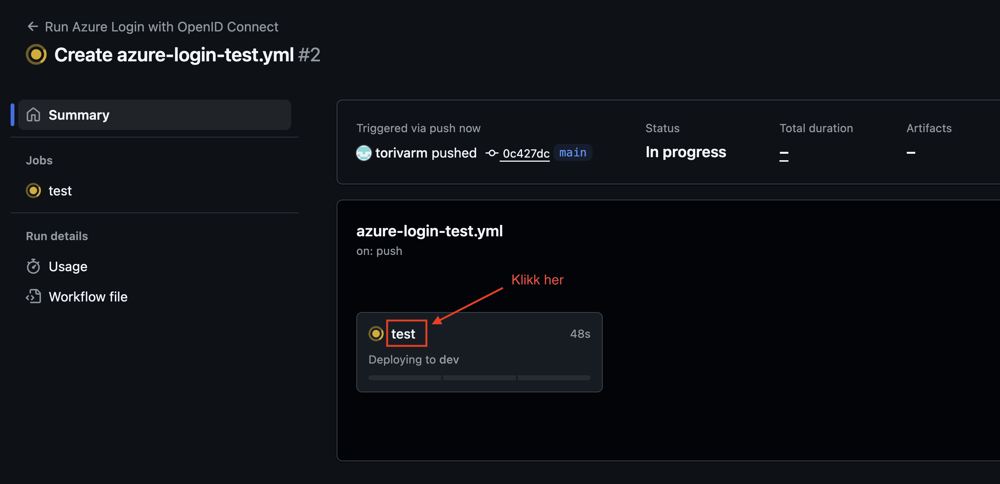
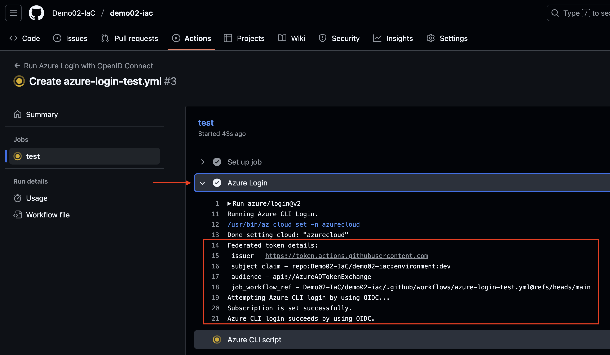
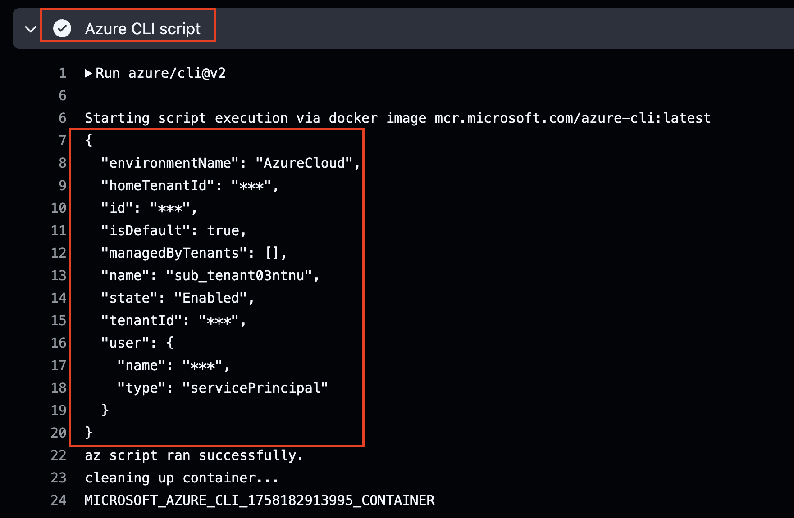

# Veiviser: Test av Federated Credentials med GitHub Actions

Når du har satt opp **federated credentials** mellom GitHub og Azure, bør du teste at tilkoblingen fungerer. Denne guiden viser deg hvordan du gjør det med en enkel workflow-fil.

---

## 1. Opprett workflow-fil
1. Gå til ditt repository i GitHub.
2. Klikk på **Actions** i menyen.
   1. 
3. Opprett en ny workflow eller velg **set up a workflow yourself**.
   1. 
4. Lag en fil med navnet:  
   `.github/workflows/azure-login-test.yml`
5. Lim inn følgende innhold:
   1. 

```yaml
name: Run Azure Login with OpenID Connect
on: [push]

jobs:
  test:
    # Viktig: gi jobben et miljønavn som matcher federated credential i Azure
    environment: dev

    permissions:
      id-token: write
      contents: read

    runs-on: ubuntu-latest
    steps:
      - name: Azure Login
        uses: azure/login@v2
        with:
          client-id: ${{ secrets.AZURE_CLIENT_ID }}
          tenant-id: ${{ secrets.AZURE_TENANT_ID }}
          subscription-id: ${{ secrets.AZURE_SUBSCRIPTION_ID }}
          enable-AzPSSession: false

      - name: Azure CLI script
        uses: azure/cli@v2
        with:
          azcliversion: latest
          inlineScript: |
            az account show
```
---

## 2. Viktige detaljer
- `environment: dev` må matche **navnet på environment** i GitHub **og** den federated credential du opprettet i Azure.
- `permissions: id-token: write` er nødvendig for at GitHub kan be om et OIDC-token.
- Secrets `AZURE_CLIENT_ID`, `AZURE_TENANT_ID` og `AZURE_SUBSCRIPTION_ID` må allerede være lagt inn i repository settings.

---

## 3. Kjør workflow
1. Commit changes til repository
   1. 
2. Skriv inn en commit message og velg Commit changes
   1. 
3. Gå deretter til fanen **Actions** i GitHub.
4. Velg workflowen du nettopp opprettet (klikk på navnet, kan ta noen sekunder før den dukker opp).
   1. 
5. Følg med på loggene.
   1. 
   2. 
   3. 

---

## 4. Sjekk resultatet
- Hvis oppsettet fungerer, vil du se at `az account show` returnerer detaljer om din Azure-konto (Subscription ID, Tenant ID osv.).
- Hvis det feiler, sjekk:
  - At environment-navnet matcher nøyaktig (`dev`, `test`, eller `prod`).
  - At federated credentials i Azure Portal peker på riktig **organisasjon/repository/environment**.
  - At secrets i GitHub er lagt inn korrekt.

---

## 5. Variant for test og prod
For å teste `test` eller `prod`, kan du enten:
- Endre `environment: dev` til `environment: test` eller `environment: prod` i samme fil, **eller**
- Kopiere filen og gi den nytt navn, f.eks. `.github/workflows/azure-login-test-env.yml` og `.github/workflows/azure-login-prod-env.yml`, og endre `environment`-feltet.

> Husk: Det må finnes en **federated credential** på App Registration i Azure som peker til akkurat det environment-navnet du bruker i workflowen.

---

## 6. Disable workflows
Etter at en ferdig med å teste er det lurt å disable (eventuelt slette) workflow. Workflow som er opprettet har on: [push] som trigger, og vil derfor kjøre hver gang en pusher noe til repoet. Om en har flere workflows (dev,test,prod) må disse også disables.
- 

✅ Hvis du ser output fra `az account show`, er federated credentials satt opp riktig, og du kan bruke dette til Terraform-workflows og andre GitHub Actions.
